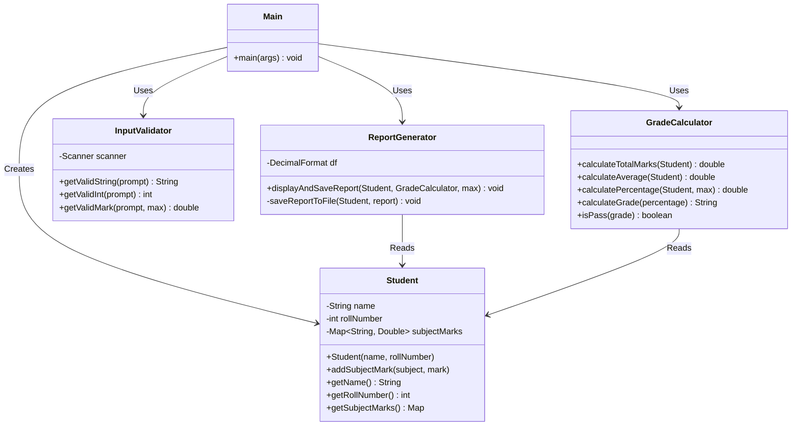

# 🎓 Java Grade Calculator

A professional, beginner-friendly console-based Java application to calculate student grades, percentages, averages, and generate comprehensive report cards.

## 🌟 Features
- Accept student details (Name, Roll Number)
- Dynamic subject entry with marks validation
- Calculates total marks, average, and percentage
- Determines grade based on percentage:
  - `A+` : 90 - 100
  - `A`  : 80 - 89
  - `B`  : 70 - 79
  - `C`  : 60 - 69
  - `D`  : 50 - 59
  - `F`  : Below 50
- Determines Pass/Fail status
- Generates a neat formatted report card
- Saves report automatically to a text file in `reports/` folder

## 🛠️ Tech Stack
- **Language:** Java
- **Architecture:** Layered Architecture
- **Concepts Used:** OOP, Exception Handling, Collections Framework, File I/O

## 📁 Folder Structure
```
Grade_Calculator/
│
├── src/
│   ├── Main.java                        # Entry point
│   ├── model/
│   │   └── Student.java                 # Data model for student
│   ├── service/
│   │   └── GradeCalculator.java         # Core business logic
│   ├── utils/
│   │   └── InputValidator.java          # Safe input handling
│   └── report/
│       └── ReportGenerator.java         # Handles displaying and saving reports
│
├── reports/                             # Saved generated reports
├── screenshots/                         # Execution screenshots
├── docs/                                # Documentation and class diagrams
├── Makefile                             # Build script for Linux/Mac
├── run.sh                               # Shell script to build and run (Linux/Mac)
├── run.bat                              # Batch script to build and run (Windows)
└── README.md                            # Project documentation
```

## 🏗️ Architecture & Class Diagram

The project uses a clean layered architecture separating concerns into:
- **Model:** Represents data objects (`Student`)
- **Service:** Contains business logic for calculations (`GradeCalculator`)
- **Report:** Handles presentation and file storage (`ReportGenerator`)
- **Utils:** Reusable utilities like input handling (`InputValidator`)

### Class Diagram (UML)


## 🚀 How to Run

### Option 1: Using the provided shell script (Linux/Mac)
```bash
chmod +x run.sh
./run.sh
```

### Option 2: Using Makefile (Linux/Mac)
```bash
make run
```

### Option 3: Using the batch script (Windows)
Double-click `run.bat` in your file explorer, or run it from the command prompt:
```cmd
run.bat
```

### Option 4: Manual compilation (Any OS)
1. Navigate to the `Grade_Calculator` directory.
2. Compile the source code:
   ```bash
   javac -d bin -sourcepath src src/Main.java src/model/*.java src/service/*.java src/utils/*.java src/report/*.java
   ```
3. Run the application:
   ```bash
   java -cp bin Main
   ```

## 🤝 Contributing
Contributions are welcome! If you are a beginner looking for open-source experience, feel free to fork this project, add new features (e.g., adding a database, GUI, etc.), and create a pull request.
