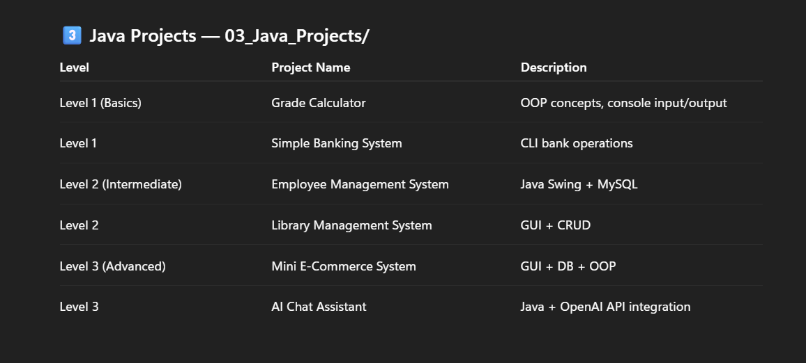

<h1 align="center">
  ☕ Java Projects Portfolio
</h1>

<p align="center">
  <b>A curated collection of progressively complex Java projects demonstrating clean architecture, OOP principles, and industry-standard engineering practices.</b>
</p>

<p align="center">
  
</p>

<p align="center">
  <a href="https://github.com/Mr-Anonymous-Guy/03_Java_Projects/actions/workflows/ci.yml"></a>
  
  
</p>

<p align="center">
  
  
  
  
  
</p>

---

## 📖 Overview

This repository serves as a **Java Software Engineering Portfolio**, structured to demonstrate progressive mastery of Java fundamentals through real-world projects.

**Target Audience**: CS students, self-learners, and developers preparing for internships or entry-level software engineering roles.

**What You'll Learn**:

- Object-Oriented Programming & SOLID Principles
- Clean Architecture & Layered Design
- JDBC Database Connectivity
- Java Swing Desktop GUI Development
- Build Automation with Maven and Makefiles
- REST API Integration (Ollama LLM)
- Design Patterns (Strategy Pattern)

---

## 📁 Repository Structure

```
03_Java_Projects/
│
├── Grade_Calculator/                # Level 1 — Console App
│   ├── src/
│   │   ├── Main.java
│   │   ├── model/Student.java
│   │   ├── service/GradeCalculator.java
│   │   ├── utils/InputValidator.java
│   │   └── report/ReportGenerator.java
│   ├── reports/                     # Auto-generated report cards
│   ├── Makefile
│   ├── run.sh / run.bat
│   └── README.md
│
├── Simple_Banking_System/           # Level 1 — Console App
│   ├── src/
│   │   ├── Main.java
│   │   ├── model/Account.java, Transaction.java
│   │   ├── service/BankingService.java
│   │   ├── storage/FileManager.java
│   │   ├── utils/InputValidator.java
│   │   └── report/StatementGenerator.java
│   ├── data/                        # Serialized account data
│   ├── Makefile
│   ├── run.sh / run.bat
│   └── README.md
│
├── Employee_Management_System/      # Level 2 — Desktop GUI
│   ├── src/main/java/app/
│   │   ├── Main.java
│   │   ├── model/Employee.java, Department.java, User.java
│   │   ├── dao/EmployeeDAO.java, DepartmentDAO.java, UserDAO.java
│   │   ├── service/AuthService.java, EmployeeService.java
│   │   ├── ui/LoginFrame.java, DashboardFrame.java
│   │   └── utils/DatabaseConnection.java
│   ├── src/main/resources/database/
│   │   ├── schema.sql
│   │   └── sample_data.sql
│   ├── pom.xml
│   ├── run.sh / run.bat
│   └── README.md
│
├── Library_Management_System/       # Level 2 — Desktop GUI
│   ├── src/main/java/app/
│   │   ├── Main.java
│   │   ├── model/Book.java, Member.java, User.java
│   │   ├── dao/BookDAO.java, MemberDAO.java, UserDAO.java
│   │   ├── service/AuthService.java, LibraryService.java
│   │   ├── ui/LoginFrame.java, DashboardFrame.java
│   │   └── utils/DatabaseConnection.java
│   ├── src/main/resources/database/
│   │   ├── schema.sql
│   │   └── sample_data.sql
│   ├── pom.xml
│   ├── run.sh / run.bat
│   └── README.md
│
├── Mini_E-Commerce_System/          # Level 3 — Desktop GUI
│   ├── src/main/java/app/
│   │   ├── Main.java
│   │   ├── model/User.java, Product.java, Category.java,
│   │   │        CartItem.java, Order.java, OrderItem.java, Payment.java
│   │   ├── dao/UserDAO.java, ProductDAO.java, CartDAO.java, OrderDAO.java
│   │   ├── service/AuthService.java, ProductService.java, CartService.java
│   │   ├── ui/LoginFrame.java, CustomerDashboardFrame.java, AdminDashboardFrame.java
│   │   └── utils/DatabaseConnection.java
│   ├── src/main/resources/database/
│   │   ├── schema.sql
│   │   └── sample_data.sql
│   ├── pom.xml
│   ├── run.sh / run.bat
│   └── README.md
│
├── AI_Chat_Assistant/               # Level 3 — Desktop GUI + AI
│   ├── src/main/java/app/
│   │   ├── Main.java
│   │   ├── model/AssistantMode.java, PromptTemplate.java
│   │   ├── service/SystemPromptManager.java, OllamaClient.java,
│   │   │          PromptTemplateRepository.java, PromptTemplateService.java
│   │   └── ui/ChatDashboardFrame.java
│   ├── pom.xml
│   ├── run.sh / run.bat
│   └── README.md
│
└── README.md                        # ← You are here
```

---

## 🗺️ Project Roadmap

| Level | Project | Description | Key Technologies | Status |
|:-----:|---------|-------------|------------------|:------:|
| 1 | **Grade Calculator** | Console app — calculates student grades and generates report cards | Java, Collections, File I/O | ✅ Complete |
| 1 | **Simple Banking System** | Console app — account management with persistent storage | Java, Serialization, File I/O | ✅ Complete |
| 2 | **Employee Management System** | Desktop GUI — CRUD operations with MySQL backend | Swing, JDBC, MySQL, Maven | ✅ Complete |
| 2 | **Library Management System** | Desktop GUI — book/member management with CSV export | Swing, JDBC, MySQL, Maven | ✅ Complete |
| 3 | **Mini E-Commerce System** | Desktop GUI — product catalog, cart, checkout with ACID transactions | Swing, JDBC, MySQL, Maven | ✅ Complete |
| 3 | **AI Chat Assistant** | Desktop GUI — conversational AI client with 11 assistant modes | Swing, Ollama API, Gson, Maven | ✅ Complete |

---

## 🏗️ Architecture

All projects follow a clean **Layered Architecture** with strict separation of concerns:

```
┌─────────────────────────────────────────────┐
│              Presentation Layer             │
│         (Console I/O or Swing GUI)          │
├─────────────────────────────────────────────┤
│             Business Logic Layer            │
│       (Services, Calculations, Rules)       │
├─────────────────────────────────────────────┤
│              Data Access Layer              │
│   (File I/O, Serialization, JDBC/DAO)       │
├─────────────────────────────────────────────┤
│               Database Layer                │
│       (MySQL or Local File System)          │
└─────────────────────────────────────────────┘
```

**Level 1 (Console)**: Model → Service → Report/Utils → File System  
**Level 2–3 (GUI + DB)**: UI → Service → DAO → MySQL  
**AI Assistant**: UI → Service (Strategy Pattern) → REST API (Ollama)

---

## 📦 Projects

### 1. 🎓 Grade Calculator
>
> **Level 1 — Console Application**

Accepts student details and subject marks, calculates totals, averages, percentages, determines letter grades (A+ through F), and generates formatted report cards saved as text files.

**Engineering Highlights**: Layered architecture, input validation with exception handling, file-based report persistence, Mermaid UML class diagrams.

---

### 2. 🏦 Simple Banking System
>
> **Level 1 — Console Application**

Simulates banking operations including account creation/deletion, deposits, withdrawals, inter-account transfers, and mini-statement generation. Persists all data using Java Object Serialization.

**Engineering Highlights**: Java Serialization for persistence, transaction history tracking with timestamps, cross-platform Makefile.

---

### 3. 🏢 Employee Management System
>
> **Level 2 — Desktop GUI Application**

Full-featured employee management desktop app with authentication, CRUD operations on employee records joined with department data, CSV export, and dark mode.

**Engineering Highlights**: N-Tier architecture (UI → Service → DAO → MySQL), PreparedStatement for SQL injection prevention, Swing event-driven programming.

---

### 4. 📚 Library Management System
>
> **Level 2 — Desktop GUI Application**

Library management with role-based login, book/member catalog, CSV export capabilities, and dark mode toggle. Database schema includes foreign key constraints and cascading deletes.

**Engineering Highlights**: Normalized relational schema (5 tables), clean DAO pattern, CSV report generation.

---

### 5. 🛒 Mini E-Commerce System
>
> **Level 3 — Desktop GUI Application**

Complete e-commerce workflow: product catalog, shopping cart, ACID-compliant checkout, inventory tracking, and payment simulation. Supports both customer and admin roles.

**Engineering Highlights**: **JDBC Transactions** with manual commit/rollback for ACID compliance, batch statements for order processing, 8-table normalized schema.

---

### 6. 🤖 AI Chat Assistant
>
> **Level 3 — Desktop GUI + AI Integration**

Conversational AI client integrating with a local Ollama LLM server. Features 11 specialized assistant modes (Coding, Study, Research, Resume, etc.) and a categorized prompt template library.

**Engineering Highlights**: **Strategy Pattern** for dynamic system prompt injection via `EnumMap`, non-blocking UI with `SwingWorker`, REST API integration with `java.net.http.HttpClient`.

---

## 🔧 Build System

### Level 1 Projects (Console)

```bash
# Using Makefile (Linux/Mac)
make run

# Using run scripts
./run.sh        # Linux/Mac
run.bat          # Windows
```

### Level 2 & 3 Projects (Maven)

```bash
# Using Maven directly
mvn clean compile exec:java

# Using run scripts
./run.sh        # Linux/Mac
run.bat          # Windows
```

> **Note**: Level 2–3 projects require MySQL. Execute the `schema.sql` and `sample_data.sql` files before running.

---

## 💻 Development Environment

| Component | Version |
|-----------|---------|
| **Java** | JDK 21 |
| **Maven** | 3.9+ |
| **MySQL** | 8.x |
| **IDE** | IntelliJ IDEA / VS Code |
| **OS** | Windows 11 / Linux / macOS |
| **Ollama** | Latest (for AI Chat Assistant) |

---

## 🧠 Engineering Principles

| Principle | Application |
|-----------|-------------|
| **Clean Architecture** | Strict layer boundaries across all projects |
| **OOP** | Encapsulation, inheritance, polymorphism throughout |
| **SOLID** | Single Responsibility in services/DAOs, Open-Closed via Strategy Pattern |
| **Separation of Concerns** | UI, business logic, and data access in separate packages |
| **DRY** | Reusable utility classes (`InputValidator`, `DatabaseConnection`) |
| **Design Patterns** | Strategy Pattern (AI Chat), DAO Pattern (GUI projects) |

---

## 🔮 Future Roadmap

- [ ] Add JUnit 5 test suites to Maven projects
- [ ] Implement Spring Boot REST API version of the E-Commerce system
- [ ] Add JavaFX alternative UI for the Library Management System
- [ ] Integrate password hashing (BCrypt) for authentication
- [ ] Add Docker Compose for MySQL database provisioning
- [ ] Create a CI/CD pipeline with GitHub Actions

---

## 👤 Author

**Mr-Anonymous-Guy**

> _Computer Science Student | Java Developer | Building real-world projects for portfolio and internship preparation._

[](https://github.com/Mr-Anonymous-Guy)

---

<p align="center">
  <i>⭐ If this repository helped you, consider giving it a star!</i>
</p>
