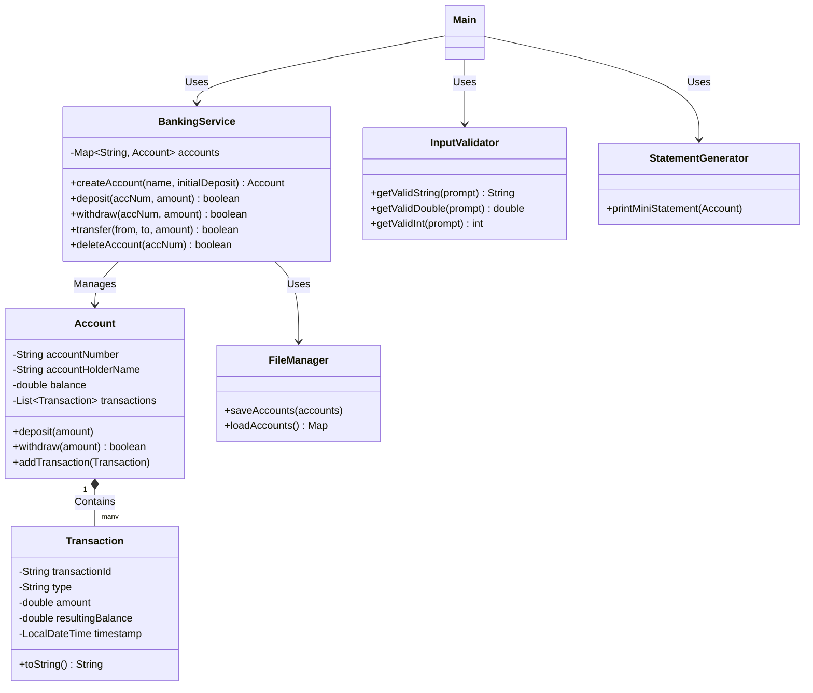

# 🏦 Simple Banking System

A professional, beginner-friendly console-based Java application simulating a real-world bank. Features file-based persistence for accounts and transaction histories!

## 🌟 Features
- **Account Management**: Create and Delete Accounts dynamically.
- **Transactions**: Deposit, Withdraw, and Transfer funds securely between accounts.
- **Persistence**: Auto-saves customer data using Java Object Serialization into `data/accounts.dat`.
- **Mini Statement**: View transaction history with formatted timestamps and running balances.
- **Input Validation**: Clean handling of user input via robust utility classes avoiding unexpected crashes.

## 🛠️ Tech Stack
- **Language:** Java
- **Architecture:** Layered Architecture
- **Core Concepts:** Object-Oriented Programming (OOP), Exception Handling, File I/O, Serialization, Collections Framework (Maps/Lists).

## 📁 Folder Structure
```
Simple_Banking_System/
│
├── src/
│   ├── Main.java                        # Interactive console menu
│   ├── model/
│   │   ├── Account.java                 # Account POJO
│   │   └── Transaction.java             # Transaction POJO
│   ├── service/
│   │   └── BankingService.java          # Core banking logic and operations
│   ├── storage/
│   │   └── FileManager.java             # Handles data persistence (Save/Load)
│   ├── utils/
│   │   └── InputValidator.java          # Safe console input handling
│   └── report/
│       └── StatementGenerator.java      # Output formatting for mini statements
│
├── data/                                # Persistent storage folder
├── docs/                                # Documentation and class diagrams
├── screenshots/                         # App execution screenshots
├── tests/                               # (Optional) Future unit test location
├── Makefile                             # Build script for Linux/Mac
├── run.sh                               # Shell script to build and run (Linux/Mac)
├── run.bat                              # Batch script to build and run (Windows)
├── .gitignore                           # Excludes compiled files and sensitive data
└── README.md                            # Project documentation
```

## 🏗️ Architecture & Class Diagram

The app is divided into clean architectural layers for modularity:
- **Model:** Represents internal entity schemas (`Account`, `Transaction`).
- **Service:** Executes business logic for making transactions and managing accounts (`BankingService`).
- **Storage:** Responsible for object serialization/deserialization to standard disk files (`FileManager`).
- **Report & Utils:** Separates purely presentational text outputs and standard input processing mechanisms.

### Class Diagram (UML)


## 🚀 How to Run

### Option 1: Using the Batch Script (Windows)
Double-click `run.bat` in your file explorer, or run it from the Command Prompt:
```cmd
run.bat
```

### Option 2: Using the Shell Script (Linux/Mac)
```bash
chmod +x run.sh
./run.sh
```

### Option 3: Using Makefile (Linux/Mac)
```bash
make run
```

### Option 4: Manual compilation (Any OS)
1. Navigate to the `Simple_Banking_System` directory.
2. Compile the source code:
   ```bash
   javac -d bin -sourcepath src src/Main.java src/model/*.java src/service/*.java src/storage/*.java src/utils/*.java src/report/*.java
   ```
3. Run the application:
   ```bash
   java -cp bin Main
   ```

## 🤝 Contributing
Contributions are highly welcome! This project acts as a fantastic stepping stone for learning Java internals. Consider contributing a Swing or JavaFX GUI, converting data storage to an SQL database, or writing JUnit test cases!
